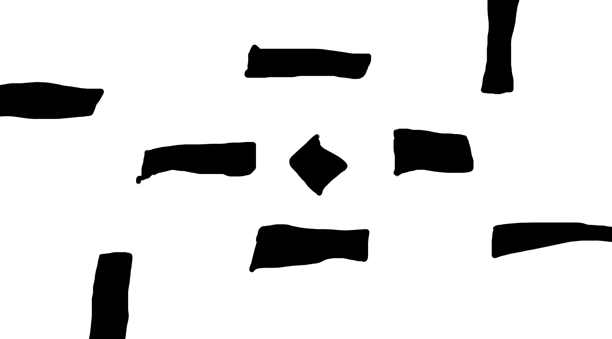
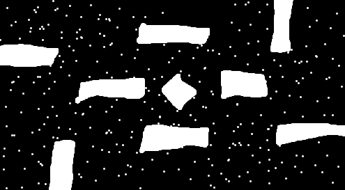

# a-gentle-introduction-to-path-finding

This is an illustration of different path finding algorithm with the same map.

Based on Python

Required lib:
``` Python
numpy
matplotlib.pyplot
cv2 #(only used for map image reading)
```



RRT: Average about 0.2s

The RRT tree



The RRT path


